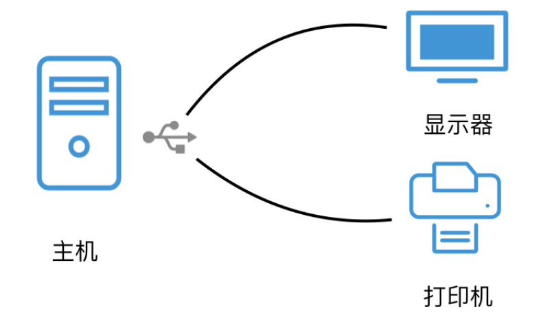

良好的代码设计可以大大减少维护的成本和潜在的bug，甚至由于积累效应会决定一个项目能否成功。在常年的codereview和查看面试作业你中发现，良好的设计和糟糕的代码设计的区别十分明显。

总结了几条实用的经验，希望对后面的项目有所帮助。文中例子使用 JavaScript 和 Java，示例仅做演示使用，这些例子都是实际遇到过的，做了一些简化。

## 快速退出

如果在一个方法中遇到大量的条件判断，正常的情况下都会想到使用嵌套if 语句或者使用 else if，但是这样一来就会出现非常复杂的嵌套。这在维护上带来了很大的麻烦。

```
function getRecommendedProductCover(user){
    const defaultCover = 'http://xxxx.jpg'
    if(user.type === 'merchant'){
        let product = getRecommendedProductByUser(user.id)
        if(product && product.picture){
            if(product.picture.src){
                return product.picture.src
            }
        }
    }
    return defaultCover
}
```

我们可以使用逆向思维来解决这个问题，如果条件满足就是用 return 快速退出。

```
function getRecommendedProductCover(user){
    const defaultCover = 'http://xxxx.jpg'

    if(user.type !== 'merchant'){
        return defaultCover
    }

    let product = getRecommendedProductByUser(user.id)
    if(!product || !product.picture){
        return defaultCover
    }

    if(product.picture.src){
        return product.picture.src
    }else{
        return defaultCover
    }
}
```

当然还可以使用一些中间变量等方法解决嵌套的问题，这种方式可以让代码看起来更加直观、简洁，有时候也可以避免无意义的数据获取。

## 消除 if 和 else if

我们看一个前端模板中非常常见的一种写法，我在大量的面试作业中出现。

```
state = {index: 1};

render() {
    const {index} = this.state;
    return (
        <div className="tab-list">
            <Navigation index={index} onChange={index => this.setState({index})}/>
            {index === 0 && <div>Tab1 content</div>}
            {index === 1 && <div>Tab2 content</div>}
            {index === 2 && <div>Tab3 content</div>}
            {index === 3 && <div>Tab4 content</div>}
        </div>
    );
}
```

这是我在一份前端作业中遇到的一个标签页切换的例子，短路运算符相当于 if 语句，显然作者把这个列表中每一个元素拿出来做了一次判断。这个逻辑显然使用循环就可以简单优雅的实现。

我们再来看另外一个常见的例子。

```
function handleErrorMessage(response){
    if(response.status === '401'){
        alert('没有登录')
    }else if(response.status === '403'){
        alert('没有权限')
    }else if(response.status === '500'){
        alert('内部错误')
    }else{
        alert('未知错误')
    }
}
```

这个例子在前端的项目中非常常见，但不一定是处理错误消息，处理这种场景也非常简单，使用一个Map对象来做一个映射即可大大提高程序的维护性。

下面一个例子更加具有代表性，如果我们需要在页面上预览不同的媒体格式，在 mediaPreview 方法中可能会写的非常复杂。

```
function mediaPreview(object){
    if(object.type === 'video'){
        ...
    }
    if(object.type === 'picture'){
        ...
    }
    ...
}
```

这个时候我们可以借助更为高级的设计模式，将不同类型的处理逻辑隔离在单独的模块中，同样可以使用一个Map对象来维护一个具体实现逻辑的列表。

```
const previewMethods{
    video: function(){
      ...
    },
    picture: function(){
      ...
    }
}
function mediaPreview(object){
    previewMethods[object.type]()
}
```

是不是看起来像某种设计模式了呢。

## 分层设计

分层设计是一种经典的程序设计，Java 服务器编程中往往有 presentation、service和dao层，现代前端也会用redux等框架来对数据和视图进行分层。

那什么样的设计是易于维护的分层设计呢？我们先看一个反面的例子。

```
public class ProductService {
    public void updateProduct(HttpServletRequest httpServletRequest) {
        String queryString = httpServletRequest.getQueryString();
        ...
    }
}
```

在一次 codereview 中看到这样一段代码，逻辑是需要在service中根据条件更新商品，作者可能为了省事儿，直接把 HttpServletRequest 这个对象在各个参数中直接传递，虽然这样看起来避免了冗余的value object定义，以及减少了参数的数量。但这样做的后果是 ProductService 和 ServletRequest 耦合了，从而造成这个service失去了复用的能力。

正确的做法是自定义一个条件类，或者直接把查询条件放到，参数列表上。

```
public class ProductService {
    public void updateProduct(String productId, String userId) {
        ...
    }
}
```

回到我们的问题，什么是好的分层设计呢？答案是每个层能被无痛的替换。以在Java 后端中的presentation层为例，一套使用表单和JSP 模板的presentation层，如果具有良好的设计可以容易的被替换成RESTful的API 而不用对service层做任何修改。

软件设计领域，最好的分层设计应该像 TCP/IP 协议族那样，每层都可以有不同的实现，所以我们才能做到WIFI和4G网络都能访问Google。

## 作用域隔离

前端开发，或者其他弱类型语言如PHP，在模块和包管理上没有语言层面足够的支持。需要特别注意作用域的暴露，先给一个前不久维护一个遗留项目中的一个例子。

其中一个 js 文件中有一个变量

```
// a.js
var isWebview = (window.navigator.userAgent.indexOf('_APP') !== -1)
if(isWebview){
    ...
}
```

后来在另外一个 js文件中也定义了isWebview方法，造成冲突。

```
// b.js
function isWebview(){ 
    return (window.navigator.userAgent.indexOf('_APP') !== -1)
}
```

由于JavaScript的类型转换 a.js 中的条件判断，就会一直当做 true。

在JavaScript中解决的方法其实很简单，可以使用function创建一个局部作用域空间，这也是前端包管理的基本原理。

```
!(function(){
    var isWebviewg = (window.navigator.userAgent.indexOf('_APP') !== -1)
    console.log(isWebviewg)

    //  创建一个局部作用域，使用 window 向外部暴露接口
    window.xxx = ...
})
```

实际上前端开发中尽量应避免使用window对象。

## 编写一个合格函数

编写函数谁不会，然而我在面试作业中碰到了这样的例子。

```
public class Utils {
    public void modifyScore(Answer answer) {
        answer.setScore(answer.getScore() + 10)
        ...
    }
}
```

这是一份 Java 作业，作者编写了一个Util 方法来修改答案的分数，但是这个方不是静态方法，甚至没有返回值，直接对传入的对象进行修改。

```
var formData = {
    phone:'123456',
    ...
}

function validateForm(){
    var phoneRegx = /xxxx/
    var valid = honeRegx.test(ormData.phone)
    ...
    return valid
}
```

这是一份 JavaScript 作业，作者拆分了验证表单的方法，但是这个方法访问了外部变量，让这个方法的拆分变得毫无意义。

好的函数或者方法，一定是通过参数获取输入，通过返回值输出数据，函数体内部不应该和外部有任何联系。

## 程序上下文

在软件开发领域，有一个概念一直没有得到重视，那就是我们编写应用程序就像撰写文章，是有一个上下文存在的。

使用了Spring boot 会产生一个Spring 上下文来管理Beans并提供了其他特性。使用了 Redux 也会存在Redux这样一个上下文。

我们再编写代码时，始终需要意识到这个上下文的存在。才能最大的利用框架和库提供的特性，但是也需要时刻警惕这个上下文中的一些限制。

例如在前端开发中，很多UI框架提供了组件的两种引用方式。一种是全局的载入和配置，第二种是可以局部单独引入构建更为复杂的应用。

在一些遗留的项目中，需要注意多套技术栈共同的存在，项目中往往多个上下文存在。编写一些公用的代码时，尽量剥离上下文的依赖和使用函数式编程，这样可以做到跨上下文复用，也可以未来跨项目使用。

我们一个项目因为历史遗留的问题一些JavaScript使用的ES5编写的，另外一些使用了ES6和打包工具编写的。在一些公共模块就难以做到复用，于是我们只能将ES6的代码从上下文中剥离（例如重新引入依赖库）打包成独立的JS UMD包文件供ES5通过scripts引入。

## 字符串

在项目中大量拼接字符串，会造成代码的可读性可维护性降低。

例如前端在处理URL时的问题：

```
const urls = {
    PRODUCTS:'/products/'  
}
function fetchProductDetail(productID){
    return fetch(urls.PRODUCTS+productID)
}
```

上面的例子中需要拼接详情的URL地址，且无法体现detail资源中的path参数。字符串的处理应该尽量避免使用+操作符链接字符串，而是使用模板来处理，模板可以用任何地方而不只是输出。

这里编写了一个处理URL path 参数的小方法。

```
const urls = {
    PRODUCTS:'/products/'，
    PRODUCTS_DETAIL:'/products/:id'  
}
function fetchProductDetail(productID){
    return fetch(paramsPath(urls.PRODUCTS_DETAIL,productID))
}

function paramsPath(pathString, ...params) {
  let result = pathString
  params.forEach((value) => {
    result = result.replace(/\:\w+/, value)
  })
  return result
}
```

JavaScript 成熟的模板库非常多，例如Ejs、Handlebars、underscore中template.不要仅仅在视图中使用模板，而是需要处理字符串的地方都可以使用。

## 理解接口

在项目中我们容易走进一个误区，看到一个场景觉得挺适合一种设计模式的，于是就引入一种设计模式。

首先，很多设计模式之间的区别非常微妙，同一种场景可以使用不同的设计模式实现。例如策略模式和门面模式某些时候很难区分。

其次，有时候我们不需要一个设计模式完整的实现，可以参考这种设计模式的思想做一些定制。

在使用模式之前需要彻底理解的是面向对象，特别是继承和接口。由于JavaScript没有语言层面的的 interface，但实际山接口无处不在。

比如，如果一组信息需要渲染给显示器和打印机等不同的设备，我们可能这样写。

```
const PrintViewer = {
  render(){
    ...
  }
}

const BrowserViewer = {
  render(){
    ...
  }
}

function render(){
  // 使用工厂方法获取不同的渲染对象
  const reviewer =  this.getViewer()
  reviewer.render(this.data)
}
```

在前端开发中，如果不使用TypeScript 等类型工具，我们无法做到在语法层面上检查每个 viewer 都有render方法。但是如果想让程序正确运行，我们不得不在团队中约定，viewer 比如提供一个render 方法。

**在软件开发中，接口实际上是一种约定。**



在现实世界中接口是通信设备和零件之间的契约

## 复用的陷阱

在做前端开发的时候非常容易陷入一个误区，就是把视图拆分成独立的组件，拆分代码这个实践没有问题，但是应该注意为何而拆。

比如我们有一个数据列表页面，这个页面上大致有筛选部分、内容部分、分页部分，在codereview 中看到过一个 vue 的案例，有人把一个也买的呢头部、中部、底部拆分成不同的组件，但是这些组件是当前页面内部和业务相关的，只是不同的部分而已。

拆分之后各个组件的数据又需要通过props和event来传递，带来了额外的负担。

因此我们在组件拆分的时候，需要考虑以下几点：

1. 拆分出的组件是否和业务有关联，如果和业务关联需要进行剥离
2. 从业务代码中抽离组件，而不是提前设计组件
3. 考虑组件拆分的成本和收益，组件拆分后会带来组件之间通信、可读性下降等潜在成本

## 起一个好名字

曾经接手过一个遗留项目，这个项目的原作者我猜测应该是广东人，因为变量命名的风格太过于清奇。变量名中不仅有英文简写（不完整的单词例如 btn ）、数字和拼音，更为恐怖的是驼峰和下划线混用，甚至拼音都不是普通话。

```
$sqlus = "xxx";
$rsus = mysql_query($sqlus);
$countus = mysql_fetch_assoc($rsus);
$usercxpass = $countus["cx_pass"] . ',' . $pa_cjh;//车架A
$arr = array($countus["cx_pass"]);//编码数组
$arrsl = explode(",",$countus["cx_shul"]);//品牌查询次数数组
/////////////////pdcxsz////////////////////////
$arrnull = array();//空数组
foreach ($arrsl as $key => $values) {//查询并写入新
    if (strstr($values, $pa_pingp) !== false) {
        array_push($arrnull, $values);
    }
}
if ($arrnull[0] == "" and $countus["cx_date"] == $l_date1) {//日期当前不存在就写入
    $arrsl[] = $pa_pingp . '1';//写入新查询
//  print_r($arrsl);
} elseif ($countus["cx_date"] <> $l_date1) {//日期之前不存在就写入
    $arrsl = array($pa_pingp . '1');//写入新查询
} elseif ($arrnull[0] <> "" and $countus["cx_date"] == $l_date1) {//存在就修改
    $czxincs = substr($arrnull[0], -1);//实已查
    $dqppkey = array_search($arrnull[0], $arrsl);//已查当前分健值
//  echo $czxincs.'<br />';
    $arrsl[$dqppkey] = $pa_pingp . ($czxincs + 1);//更新数组
}
```

我想上面这段代码几乎没人看懂，所以起一个好的名字对维护性非常重要，所以在变量命名时最好遵循下面的规则：

1. 使用一种命名风格，驼峰或者下划线
2. 避免使用拼音和数字
3. 避免使用缩略词
4. 注意单词错误、时态和大小写

另外有的时候实在想不出变量名，可以借助一些工具，例如 https://unbug.github.io/codelf/ 提供了浏览器和编辑器插件，可以从开源代码库中搜索一些有用的代码作为参考。

另外一种我比较喜欢的命名方式是参考一些标准写法。“微格式”是一种互联网“潜规则”，用于赋予HTML元素有意义的名字便于第三方应用程序或搜索引擎抓取。所以我在编写前端代码时，参考微格式不用费脑筋设计HTML结构和命名，同时也有让HTML足够语义化。


图片来源：https://developer.mozilla.org/en-US/docs/Web/HTML/microformats

