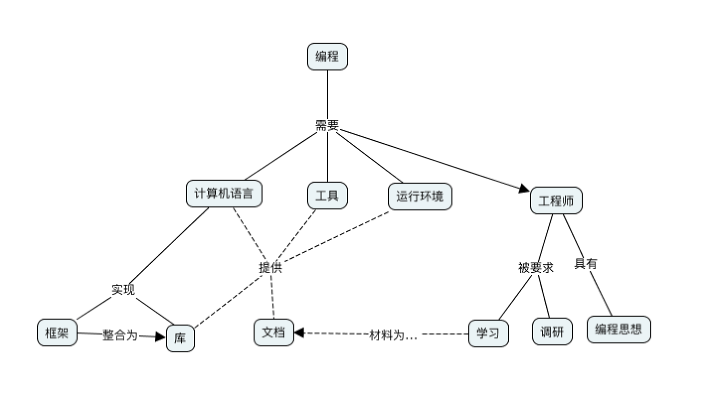
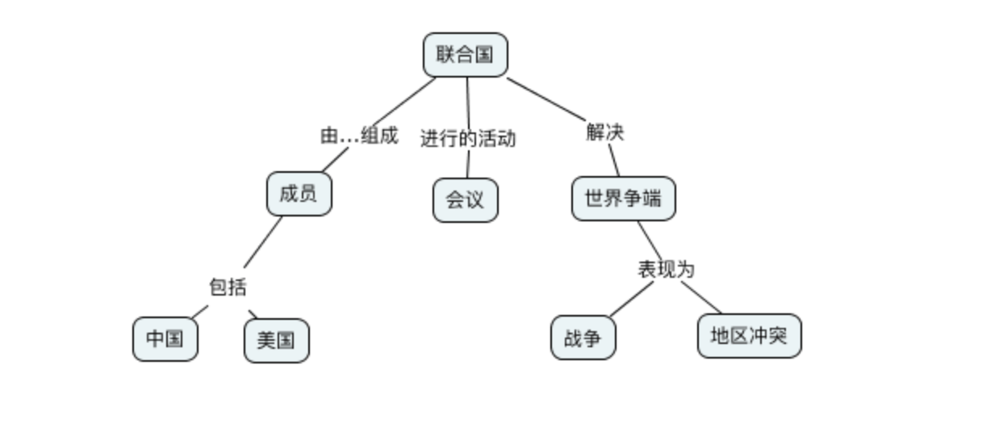
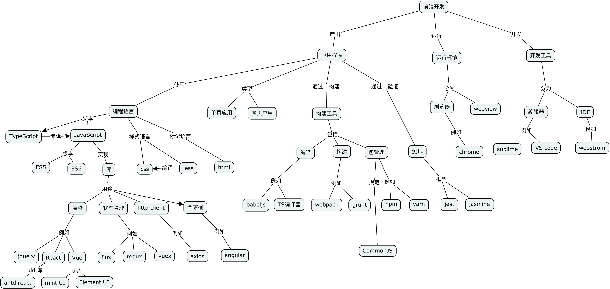
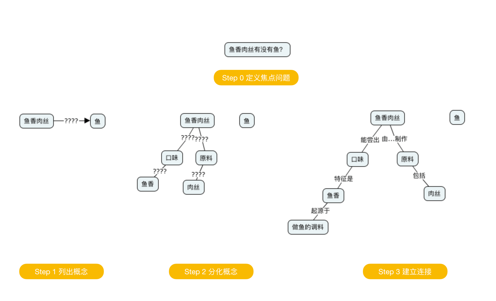

我是半个计算机专业的，我会把有故障的硬盘拆下来，也能把一块新的硬盘装回去，还能使用U盘或者光盘给它安装一套操作系统。

这能算我会修电脑吗？不，我不会，至少过年回家时对要求我义务修电脑的亲戚们说不会。但为难的是他们总能说出这句我无法反驳的话，“你一个学计算机的修个电脑都不会。“ 我内心嘀咕着 ”学化学的也不会造 TNT”，但实在无法找到一个合理的理由拒绝。

随着对逻辑学的进一步了解，“大妈式”的暴力辩论逻辑实际上是一种典型的偷换概念，计算机维修和学计算机完全是不同的概念。我们用下面的图来表达修电脑和学计算机之间的关系：

所以可以给出下面理由 —— 为什么计算机相关专业的学生不会修电脑。

- 一本正经版： “因为我只是学计算机相关专业的一种，主要是做软件工程的，你这个屏幕不亮了属于硬件，因此这活儿做不了”
- 简单直接版：“我没有工具，人家专门修电脑的人有 xxxx（一堆听不懂的东西）”
- 胡扯版：“我是学微型计算机大规模分布式运算服务的（服务器编程）”

所以通过梳理概念之间的关系，可以清晰得到一个概念，可以通过使用概念图来描述概念的层次关系，上面使用的图即是概念图。

美国著名教育学家诺瓦克遇到了同样的问题，他需要一种清晰地方式给学生解释一些课程中需要用到的概念。同时，也需要了解学生在理解概念上的变化。他们的研究小组从拓扑分类学和语义学方面得到灵感，创造出“概念图”这一思维工具来表达概念的练习。

例如一个常见的错误逻辑关系是 “中国属于联合国”，联合国是一个组织，而中国是一个国家，应改为“中国属于联合国成员国”。那么用概念图描述就是：

在学习编程过程中伴随着大量的概念，例如编程语言、Java、JVM 等抽象层次不一致的概念关系该如何梳理；在前端开发中 npm、浏览器看似没有关系两个概念是怎么在平时开发过程中联系到一起的；或者扯远一点，怎么解释《公孙龙子》“三脚鸡”的逻辑问题 —— 鸡有脚，并且数的时候每只鸡有两只脚，那合起来是不是鸡有三只脚。

对于这些问题，可以使用概念图帮我们梳理概念的层次关系，下面让我们进一步了解概念图是如何帮我们更好地梳理大量概念的。

## 编程语言相关概念点

有一天我回到办公室，有两个同事在讨论编程语言相关的内容。

同事 A：“我是做 Python 的，我现在想转 Java”。
同事 B：“编程思想都是一样的，什么语言都一样”
同事 A：迷惑中

A 想从 Python 转到 Java ，可能是市场对 Java 的接受程度更高，但有时候会有人说“编程语言都一样”。看起来 B 说的很有道理，但他们说的是同一回事吗？

实际上 A 是想表达对编程职业生涯的担忧，“Java” 在他的意识里是指的相关整套技术体系，B 想说的只是用来完成编码的计算机语言。我们用概念图看下“编程”这个概念，再来看他们讨论的是不是同一个东西：

我们真的只是缺乏编程思想吗？

我们要完成编程这个活动，需要了解编程语言、框架、库以及阅读相关的文档、书籍和开源代码。切换技术栈的成本是巨大的，不只是具有编程思想这么简单。

往往我们在谈论 Java 时，谈的不仅仅是一个编程语言的 Java，我们还在谈 JDK、JVM、Spring 等内容；甚至我们在谈论 Spring 的时候我们在谈论 Spring IOC、Spring MVC 以及 Spring boot。

谈论数据库的时候也会谈论 DBMS、SQL、JDBC、driver、ORM 等概念，甚至包含了数据库连接的客户端工具例如 Navicat，有时候也会谈数据库的具体实现：MySQL、Oracle 或者其他 NoSQL 数据库。

甚至谈论数据库这个概念本身往往都包含了多个含义：数据库管理系统（DBMS）、一个数据库实例（DB）。

## Java 服务器编程相关概念点

我在刚刚学习 Java 技术栈做 WEB 服务器开发时对很多概念非常困惑，Java 的生态非常完善，带来的概念也非常多 —— JPA、Servlet容器、Tomcat 等，它们的关系对于初学者来说相当的微妙。在使用 PHP 开发网站时，往往只需要查阅 PHP 的文档和一个框架的文档，而Java 生态圈充斥着大量陌生概念。

我整理了一份侧重于 Java、Servlet、Spring 家族一系列概念的概念图，这里主要关注几个比较难以分清的概念，真实的 Java 服务器开发领域所涉及的概念还非常多。

作为语言的 Java 衍生出来的概念是相关的运行环境、库和框架。Java 字节码运行在由 JRE 运行环境提供的 JVM 虚拟机之上的，Tomcat 是一个 Java 应用程序，并提供了 Servlet 容器负责处理 HTTP 的请求和响应进行，而我们做的应用程序（WAR）只是一个寄生兽，挂靠在 Servlet 容器上负责处理业务逻辑。

库最具有代表性的是 Spring。Spring 这个词本身只是只一个 IOC 库，后来不断发展，Spring 实际上衍生成 Spring IOC、Spring MVC、Spring Data 等库的一个集合。最终由 Spring boot 整合成一个完整的框架。

而对数据库的操作又是一堆概念。Java 程序使用 JDBC 的驱动（数据库具体的 Driver）连接数据库，人们又希望使用 ORM 技术让对象和数据库记录同步，这一实现主要有 Hibernate、TopLink，Java 社区做了规范称为 JPA。Spring data JPA 又对 JPA 做了封装使之在 Spring 环境下更易用。

通过梳理这些概念可以给学习 Java 编程的新人推荐一个合适的学习路线：计算机基础->计算机网络->Java 基础-> Servlet -> Spring IOC -> Spring MVC-> Spring Boot。没有前置概念的铺垫，直接学习 Spring Boot 是相当痛苦的。

## 前端开发概念点

最近很火的 Vue 是一个框架还是一个库，亦或者是一个开发体系？

随着前端开发工程化的发展，现代前端开发体系爆炸性的增长，每天都在出现新概念，那么学习前端到底该学些什么呢。下面我整理了一个前端常见概念点的概念图：

前端开发在 Nodejs 出现之前还是非常简单和容易理解的，在浏览器中运行的页面无非是 HTML、CSS、JavaScript。Nodejs 把 Chrome 的 JavaScript 引擎单独拿出来运行 JavaScript 脚本，并提供了很多操作系统的 API，形成独立的运行平台。JavaScript 的应用场景从浏览器中脱离出来，变得无比开阔。

Nodejs 提供了网络相关的 API，于是 JavaScript 便可以通过通过 TCP 协议编写 Socket 代码，从而进一步实现 HTTP 协议，得到 WEB 服务编程的能力。

Nodejs 也提供了文件相关的 API，JavaScript 便能够具备文件生成、JavaScript 的压缩、Less 到 CSS 的转换等前端工程构建的相关能力。于是 JavaScript 可以反过来对 JavaScript 代码文本处理，构建 JavaScript 项目（无论前端还是后端）。从最开始利用 grunt 对JavaScript 代码进行简单的压缩、混淆、模板替换等，到后面的 gulp 更灵活的构建工程，以及现在的 webpack 对前端资源彻底的整合。

Nodejs 平台上也可以运行包管理程序来对各种依赖管理，这就是 npm 和 yarn，这就是 Nodejs、npm、JavaScript 的概念关系。

同理，对于前端各种库来说，它们的关系通过概念图也能表达的更为清晰。React 和 Vue 都只是发布在 npm 中的一个库，前端项目需要这些各种库作为原料，并通过构建工具来做成蛋糕，并放到浏览器中呈现给用户。

以上就是前端开发生态发展的基本逻辑。

## 构建你自己的概念图

想要表达对概念的理解，你可以很容易的构建出自己的概念图。

一个典型的概念图主要有节点、连接线两种元素构成，分别对应了概念、概念的联系，两个相连的概念之间可以构成逻辑命题，命题应该能通过节点和连接线读出。

绘制概念的方法非常简单，你只需要在纸上或者专用的软件（下载链接见文章附录）罗列出相关概念然后使用连接点标记出概念的关系即可。诺瓦克给出了一个非常详细的构建概念图的流程，这非常适用于教育专家来处理日常遇到的大量复杂的信息和概念，但对于大众来说稍显冗长。我做了一点简化和改进，归纳如下：

- **确定概念图需要解决的焦点问题。** 例如我需要解决”鱼香肉丝里面有没有鱼“的问题，或介绍 ”鱼香肉丝“ ，围绕着鱼、动物、鱼香、调料、烹饪、口味、肉丝、鱼香肉丝、川菜等概念来构建概念图，然后得到命题 ”鱼香是一种口味“，”鱼香的调料起源是用来烹鱼“ ，从图中我们得不到 ”鱼香有鱼“ 这样的命题。在解决这个问题的过程中，鱼生活在池塘中，池塘、水草等概念就没有意义了。
- **罗列关键概念。** 围绕着焦点为题来寻找概念，但是概念不宜多，在罗列概念时，尝试对概念进行定义，使用- 更准确地词替换模糊的词。例如讨论编程时大家喜欢用”语言“这个词，尽量使用”编程语言“这类准确地词
- **寻找概念的冲突和二义性，分化概念。** 《公孙龙子》在三脚鸡的辩论中，”鸡有脚，数数时，鸡有两只脚，加起来有三只脚“。这里的鸡的概念有集合个体两个内涵。可以分为”鸡“和”一只鸡“两个概念。《公孙龙子》中类似的例子还有 “白马非马”的著名辩论
- **构建联系，得到命题。** 将分化后的概念，通过连接线连接起，连接过程中给出一个合理的连接词，概念+连接词+概念成为一个完整的命题。例如 ”鱼香是一种口味“。

上面是从操作流程上归纳创建概念图的方法，另外在构建的逻辑上，概念的关系一般有下面两条线索：

- **概念的抽象程度。** 这种思考方画出来的图往往是一个树状，从上到下是概念抽象层次的逐渐收敛的过程。例如计算机科学->计算机硬件-> CPU -> Inter CPU-> I5。概念从从抽象逐渐到具体，这是一种理想的概念图构建方法，读者能从上到下找到清晰地逻辑关系和明确的命题。
- **概念的联系紧密程度。** 画出来的图往往是一个网状，从上到下是概念联系逐渐从紧密到疏远的过程。Java->编程语言->编译型语言，可能两个概念没有直接关联了。这是现实中很正常的情况，一术语往往具有多个概念，概念之间又不断延伸和交叉。

概念图和思维导图的最大区别就在这两条线索上。概念图是用来表达概念的关系，节点之间应该具有逻辑关系，可以说是收敛的；思维导图是用来促进创造性思维的，条目之间具有引导的关系，可以说是发散的。

## 使用概念图的要点

概念图其实只是反映你思维逻辑的一个可视化工具，概念图能清晰分析问题的前提是思维和逻辑是清晰地。绘制概念图，首先需要对“概念”理解和定义清楚，“概念” 这个词从古到今、从外到中，有非常多的解释，有认知论、哲学、教育学等解释。

概念图的发明者罗瓦克对概念的定义非常朴素：从事件或对象中感知到的规律或模式，可以打上一个标签，这个标签就是概念。

维基百科的定义是：概念是抽象的、普遍的想法，是充当指明实体、事件或关系的范畴或类的实体。通俗来说，概念是人对事物认识的基本元素，例如“马”、“天空”。现代哲学把概念的内容和范围定义为了外延和内涵。通过外延和内涵指导区分从一个概念演变出来的新的概念。例如“计算机”的外延可以延伸为“计算机维修”。

概念图就是用来表达概念之间的延伸关系和抽象程度的，从而达到梳理概念的目的。 笛卡尔将概念的清晰度和抽象程度称为是概念的特征。

每个人构建概念和概念之间的逻辑关系都是不一样的，所以每个人绘制概念图都是不一样的。

## 常见问题

在实际使用概念图有一些比较常见的问题，我也会犯一些错误。这是因为自然语言本来就是不准确的，概念也具有人主观认识的成分。我们来看下在绘制概念图的过程中，常见的误区是什么，也可以通过这些问题来作为审视概念图是否优良的方法。

### 主题范围失控，概念图没有焦点

做出取舍，解决该解决的问题，解决不了的问题收敛主题，并再画一张图。例如我想要辨析的主要内容是：Java、JVM、Spring 等几个概念的逻辑关系，我开始想绘制一个非常大的主题“服务器编程”，这样的话我就必须把 PHP、Go 等其他语言纳入了，但这些内容和我想要辨析的主题关系并不大。于是我最终选择收敛主题到 “Java服务器编程”，把焦点聚焦到 Java 和 Spring 上。

如果需要表达 Java、PHP 概念之间的关系，我需要发散主题 “服务器编程” 然后进行绘制，但是不会加入 Spring 相关的内容，概念图的深度也可能不会到达 Spring mvc、Zend PHP 这样层次的深度。

概念图不必追求大而全。

### 概念层次不清晰

把概念图绘制成流程图是最容易犯的错误。概念图是表达概念的抽象层次关系，用概念图表达多个时间关系不同但抽象层次相同的概念没有意义，你应该使用一个流程图来表达。

在电商领域中，购物车、订单、支付记录，下单流程中的几个关键概念。这几个概念在抽象上是类似的。上图的左边部分是一个不好的示例，虽然表达了概念之间的生成关系，但是这些概念的内涵和外延无法在图中表达。

诺瓦克在《概念图》一书中给出评价概念图的方法之一是利用拓扑分类学，主题应该体现出 “渐进分化”的特点。

### 语义描述不当

概念图节点是概念，概念是认知世界的元素，按照诺瓦克定义来说，就是给印象中的事物打一个标签。概念应该有名词（包括抽象名词）、动名词、形容词，而概念之间的关系可以为动词、介词、副词。

好的概念图还需要对读者友好，阅读者能组合概念和概念的联系变成条有意义的命题，例如 “马分为白马“。虽然不一定具有语法上的完整性，但是逻辑关系非常重要。

## 参考书目和附录

- 专用概念图绘制工具 [https://cmap.ihmc.us](https://cmap.ihmc.us/)
- 通用画图工具 https://www.draw.io/
- 概念图的维基百科 https://en.wikipedia.org/wiki/Concept_map
- 笛卡尔《方法论》
- 诺瓦克《概念图》
- 公孙龙《公孙龙子》
