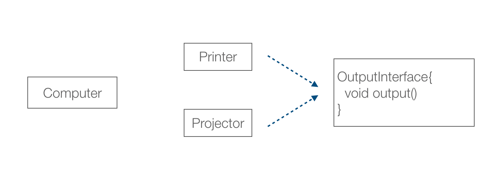
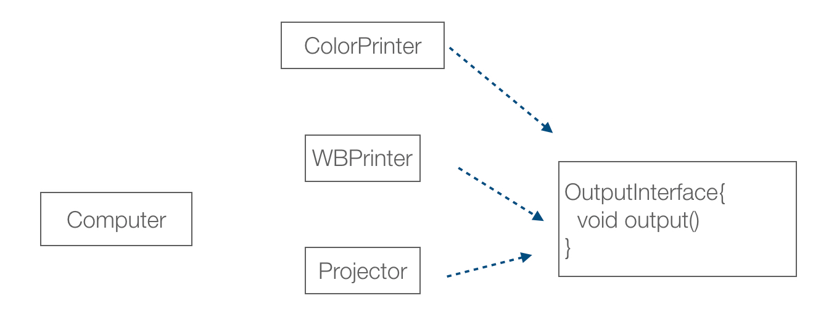
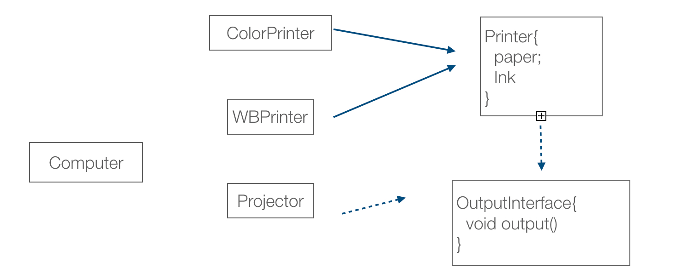
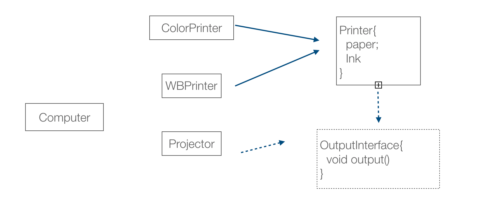
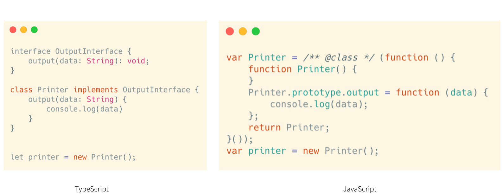
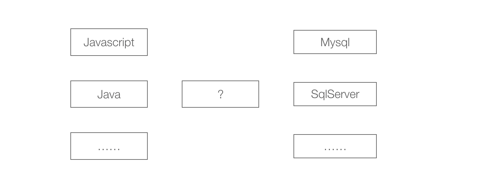
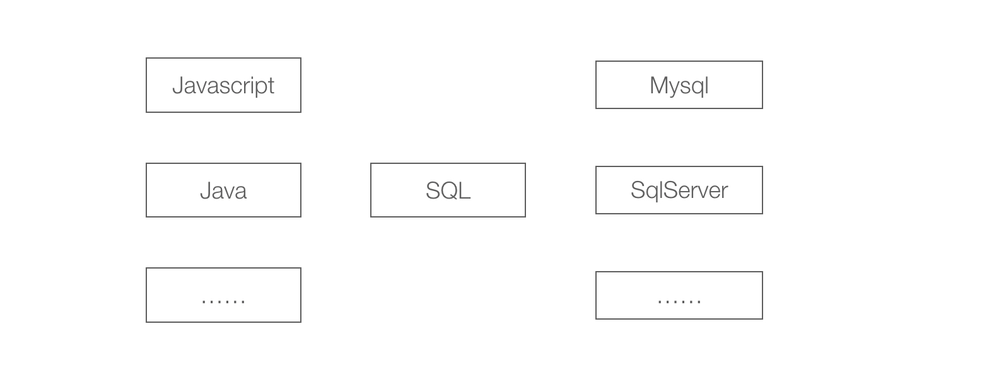

计算机科学本应该是一个实践和具体的科学，但是随着面向对象等思想的发展，大量的概念、原则、思想含糊不清，“编程思想” 则更加玄之又玄。

接口是面向对象中最重要的一个概念之一，接口这个词被用的太过于广泛，以至于成为软件工程师们最容易争吵的地方。

我们说的接口在不同上下文中略微不同，我猜测这是容易引发争论的原因，尝试分解为几个不同的场景，同时给出一些例子说明接口的不同含义。

## 强类型语言中的 interface

以 Java 为例，在强类型的语言中，天然就拥有 interface 的特性。当我们对一个功能要求多个实现的时候，我们可以先通过接口定义出需要的方法，然后使用不同的对象实现。

举个例子，现实生活中，我们想要通过一台计算机把文档或者图片投影到幕布上，同时也需要能通过打印机打印出来，那么投影仪和打印机两台输出设备必须具备支持信息输出的接口。

如果使用 Java 来实现这个业务场景，可以通过定义一个 output 方法的 interface。打印机类（ Printer ）和 投影仪类（Projector）实现这个 interface，并实现该 interface 中的 output 方法。

通过这个例子，我们可以认识到某个类为了实现某个功能必须提供一些方法，从而和系统中其他部分交互，在 Java 中通过 interface 来定义。在一些资料中，interface 被当做了一种特殊的抽象类，被认为抽象类，实际上不是特别准确。我们来拓展一下上面的例子，说明一下接口和抽象类的细微差别。

假设我们原来的打印机只能打印黑白色，现在想要实现彩色打印，我们可以增加一台彩色打印机（ColorPrinter），并把原来的打印机命名为黑白打印机（WBPrinter）。

然后我们发现彩色打印机和黑白打印机都有一些共同的东西，例如纸张、油墨等。于是我们使用了抽象类（或者一个普通父类）来归纳这些属性，就像继承财产一样。这个抽象类同时也可以实现接口，并继承给子类。

通过这个例子，在 Java 中 interface 只是定义了实现这个接口的类是否能按照具体输入（参数）实现某些功能（方法）的能力，实现接口的过程中并没有传递任何状态和属性，这一点和抽象类有本质的区别。

因此可以说在 Java 世界里的接口是一组方法定义的集合。

## JavaScript 中的接口

到了我们 JavaScript 中，不再有语言层面上的 interface，还能不能实现类似的功能呢？

答案是肯定的，我们在日常开发中也印证了这一点，JavaScript 是一门图灵完备的语言，java 能完成的任务，只要提供同样的运行环境 理论上 JavaScript 一样可以完成。只不过在实现 Projecto 和 Printer 类时，没有 interface 可以使用，开发者只能在大脑里存在一个意识： “我需要让这两个类提供命名一样、参数一样的 output 方法”。否则在运行时程序会因为找不到 output 方法而报错。

实际上，在开发 JavaScript 应用程序时，我们的 “interface” 存在于开发者的大脑和团队的约定中，下图的 interface 我使用虚线标出。

在JavaScript的世界里，缺乏语法层面上的 interface，因此只能通过口头约定来实现接口。因为缺乏语言支持，这个约定是不清晰的，可以由第三方工具或者文档来支持。

随着越来越多的开发者意识到 “interface” 其实一直都存在，但 JavaScript 没有编译这个过程，无法对 “interface” 强制约束。于是 Flow 和 TypeScript 被开发出来帮我们完成这件事，在开发时期提供了 interface 这样一种特性。

如果我们尝试对比 TypeScript 代码和编译出来的 JavaScript 代码，我们会发现 TypeScript 中的interface 会彻底消失，就像根本不存在一样。

通过编译TypeScript可以进一步证明，接口只是一个约定，编译完成后就不再需要了。实际上，对比 Java 源代码和 class字节码也能得到同样的结论。

## 跨语言的接口

当我们理解到弱类型语言中实际上也有接口存在，但是处于一个非常隐晦的概念中，我们可以把这种视角拓展的更远。下面我们再来看计算机世界中更多的例子。

其中一个有趣的例子是数据库（特指关系型数据库）。在现实开发中，各种编程语言都可以和不同的数据库通信，这再正常不过，通过 Node.js 平台 JavaScript 都可以连接 MySQL了。

回想一下我们编程语言都是怎么和数据库交互的呢？

计算机中的差异化问题都可以通过增加分层的方式解决。所以对于不同的数据库和编程语言之间，我们有一个SQL语言。SQL 在这个场景下，充当了一个接口的角色。SQL 抽象了 DBMS 应该具备的能力，数据库相关的操作就可以都使用 SQL 来完成了。

同样的例子还有很多，当我们在编写 JavaScript 脚本操作浏览器中的 DOM 时，在一定程度上不必考虑浏览器是 Chrome 还是 Firefox。DOM 充当了浏览器和JavaScript引擎的接口。甚至当 DOM 不是有浏览器来构建时，应用程序也有能力解析 HTML 并操作其中的属性。

所以在跨语言的交互中，往往存在一个容易被我们遗忘的中间层，充当着接口这一个角色。这个时候的接口是一种抽象。

## 无处不在的接口

我们还能找出更多的接口的例子吗？

当我刚刚开始学习 Java 编程时，servlet-api 依赖的引入让我非常困惑。servlet-api 是一个只包含接口的 Java 包，为什么需要引入它到项目中，而且必不可少。随着对 Java 生态的逐步了解，才知道 servlet 本身就是一个 web 容器的规范，使得我们的编写的 Java 代码能被 Tomcat、Jboss 等 web 服务器正确的运行。servlet-api 这个包也仅仅是用来在开发和编译期间去检查我们的代码是否符合 servlet 的规范。

Artur Ventura 使用 JavaScript 编写了一个 Java 虚拟机 BicaVM，理论上讲 JavaScript 也可以编译成 Java 的字节码，JavaScript 的源代码遵守 servlet-api 的规范的情况下也可以编写出能运行在 Tomcat 中的服务端应用程序。

如果我们把接口的含义拓展的更广一点的话，**接口就是协议或者规范。**

当我接触到越来越多的行业规范、软件标准、网络协议的时候，发现他们和我们在编程中谈到的接口并无二致。IP 协议让各种终端设备能接入互联网，TCP 让路由器和交换机传输数据，OSPF 能让所有的路由器共享路由表实现数据转发，而这些协议又被一种约定规范到TCP/IP 协议族中。

## 只有接口的开源项目

开源世界也正在发生变化，厂商在发布一个开源项目时，已经不在局限于开源某个软件，而是先开源一套接口或者规范。

至于是开源社区的实现，或者是其他公司的商业实现都能接入到这个生态中来。过去的开源软件往往先贡献了多种实现，然后再从中抽象出约定和规范，实现生态的完善。人们已经意识到，是不是应该先利用开源的优势，接口先行。接口一旦被定义，自然会有多个平台、不同的语言提供相应的实现，甚至非开源的商业实现也可以无缝接入。

著名的例子越来越多，GraphQL 是一个结构化的API查询语言，社区中已经有很多的实现可以做到无痛替换；Swagger 不满足于作为API文档工具，而演化出OpenAPI; 实现了 EditorConfig 插件的编辑器和IDE可以通过.editorConfig文件统一代码风格。

那么未来的接口和实现的关系会是什么样子呢？
